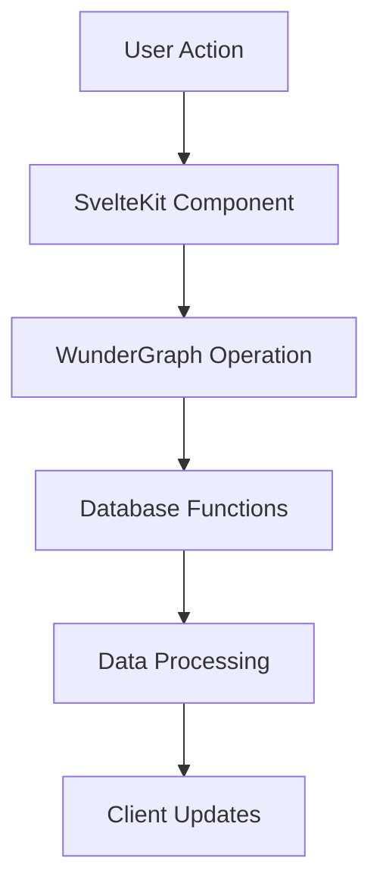
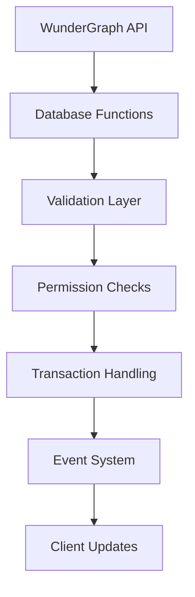
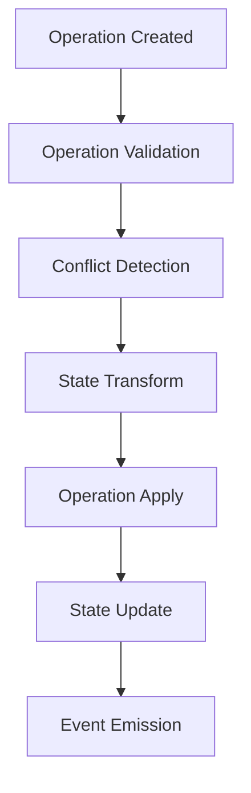
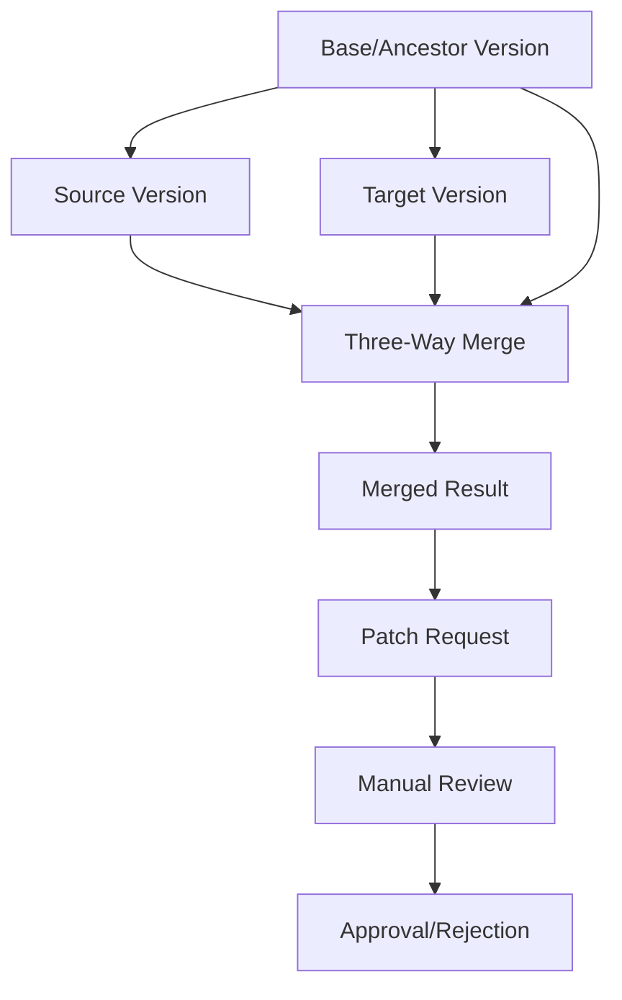
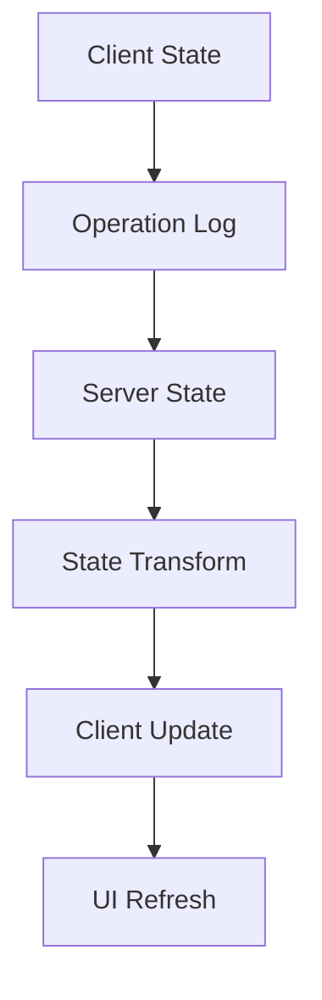
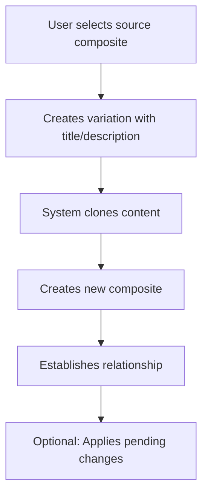
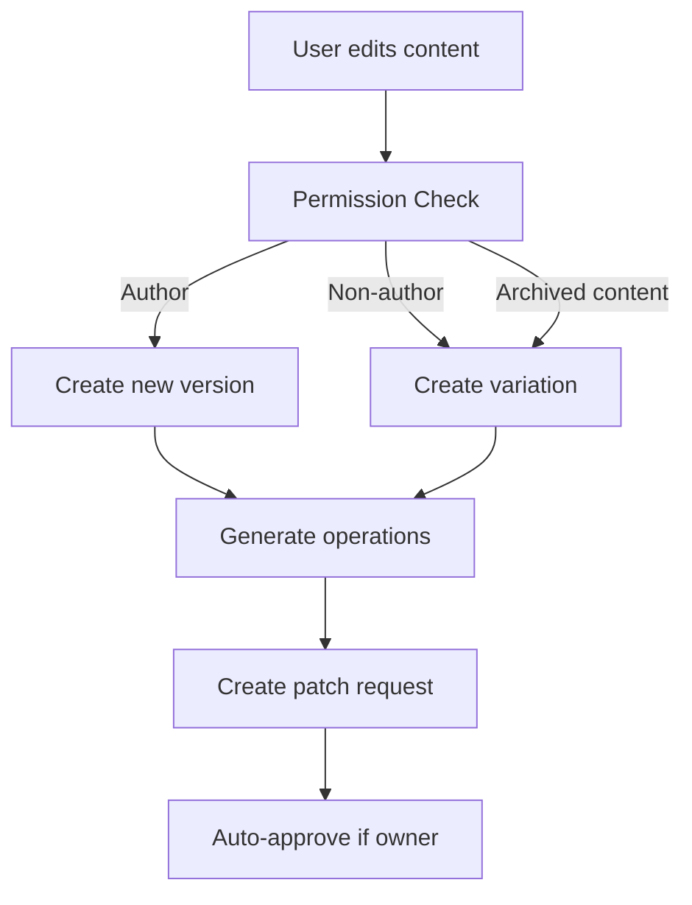
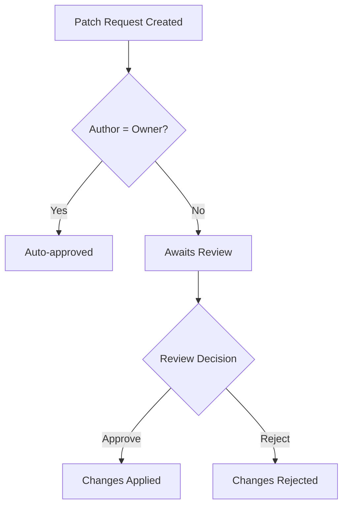
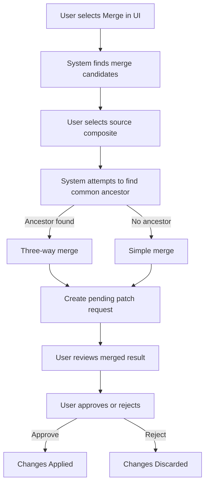

# Visioncreator Version Control & Composite System Documentation

## Overview

The Visioncreator platform implements a sophisticated version control and composite system that allows for collaborative content management with features similar to Git but optimized for content creation. The system is inspired by Yjs's CRDT (Conflict-free Replicated Data Type) approach for handling operations and conflicts, adapted for our specific use case of content versioning and collaboration.

## Core Concepts

### 1. Database Structure (DB)

The system uses a versioned database structure with three main components:

- **db**: Active content versions
  - Stores current versions of content
  - Maintains schema references
  - Tracks authorship and metadata
  - Handles immediate state
  - Provides database functions for content editing and validation

- **db_archive**: Historical content versions
  - Archives previous versions
  - Maintains version history
  - Enables rollback capabilities
  - Preserves audit trail

- **db_operations**: Granular changes tracking (Yjs-inspired)
  - Records atomic operations
  - Supports conflict resolution
  - Enables collaborative editing
  - Maintains operation history
  - Implements CRDT principles for concurrent edits
  - Uses Lamport timestamps for causal ordering
  - Maintains vector clocks for tracking causality

### Snapshot ID System

The system uses a `snapshot_id` field (UUID) to uniquely identify each version of content:

1. **Version Identification**
   - Each content version has a unique `snapshot_id`
   - Generated as a UUID when content is created or updated
   - Used to track the exact state of content at a specific point in time
   - Example:
     ```typescript
     interface ContentVersion {
         id: string;
         snapshot_id: string;
         json: any;
         author: string;
         created_at: string;
         last_modified_at: string;
     }
     ```

2. **Performance Optimization**
   - Enables quick identification of specific content versions
   - Facilitates efficient content retrieval
   - Supports caching strategies
   - Example usage:
     ```typescript
     async function getContentBySnapshot(snapshot_id: string) {
         // First check active content
         let content = await db.findOne({ snapshot_id });
         
         // If not found, check archive
         if (!content) {
             content = await db_archive.findOne({ snapshot_id });
         }
         
         return content;
     }
     ```

3. **Tracking and Auditing**
   - Provides immutable reference to specific content versions
   - Enables precise tracking of content lineage
   - Supports audit requirements
   - Example query:
     ```sql
     SELECT * FROM db_operations 
     WHERE content_snapshot_id = '123e4567-e89b-12d3-a456-426614174000';
     ```

### Important Note on Content Versioning

In our system, content versioning is managed through:
1. The `snapshot_id` field for unique version identification
2. The complete operation log for tracking changes
3. The patch request system for managing updates

This approach provides several benefits:
- Immutable content versions
- Clear lineage tracking
- Support for branching and variations
- Efficient storage of historical versions

### 2. Composites

Composites are the fundamental building blocks that represent content units. Each composite:
- Has a unique ID
- Contains a title and description
- Points to a specific content version (compose_id)
- Can have relationships with other composites
- Supports variations and forks
- Maintains authorship information
- Preserves relationship metadata including merge history

### 3. Patch Requests

Similar to Pull Requests in Git, Patch Requests manage proposed changes:
- Track changes between content versions
- Support approval/rejection workflows
- Include detailed operations history
- Enable collaborative review processes
- Auto-approve when users edit their own content
- Require manual review for merges and external contributions
- Store comprehensive metadata about operations

## Fullstack Architecture Flow

### 1. Client-Side Operations



1. **User Interface Layer**
   - Components handle user interactions
   - Manages local state with Svelte stores
   - Implements optimistic updates
   - Triggers database operations via WunderGraph

2. **WunderGraph Integration**
   - Handles API communication
   - Manages authentication state
   - Provides type-safe operations
   - Calls database functions directly

### 2. Server-Side Processing



1. **Database Functions**
   - Validate incoming content
   - Check permissions and constraints
   - Apply business logic
   - Manage transaction boundaries
   - Handle variations and cloning
   - Implement CRDT principles

2. **Database Interaction**
   - Executes operations atomically
   - Maintains ACID properties
   - Handles concurrent access
   - Manages version control
   - Creates variations when needed

### 3. Operation Flow (CRDT-Based)



#### Operation Types

1. **Add Operation**
```typescript
interface AddOperation {
    type: 'add';
    path: string[];
    value: any;
    metadata: {
        timestamp: number;
        author: string;
        lamport_timestamp: number;
        site_id: string;
        context?: any;
    };
}
```

2. **Remove Operation**
```typescript
interface RemoveOperation {
    type: 'remove';
    path: string[];
    oldValue: any;
    metadata: {
        timestamp: number;
        author: string;
        lamport_timestamp: number;
        site_id: string;
        context?: any;
    };
}
```

3. **Replace Operation**
```typescript
interface ReplaceOperation {
    type: 'replace';
    path: string[];
    oldValue: any;
    newValue: any;
    metadata: {
        timestamp: number;
        author: string;
        lamport_timestamp: number;
        site_id: string;
        context?: any;
    };
}
```

### 4. Conflict Resolution

The system uses a CRDT-inspired approach to handle conflicts:

1. **Operation-Based Resolution**
   - Each operation is atomic and self-contained
   - Operations carry enough context for resolution
   - Conflicts are resolved at operation level
   - Maintains causal history using Lamport timestamps
   - Tracks vector clocks for site-specific history

2. **Conflict Types**
   ```sql
   -- Example conflict detection query
   SELECT detect_operation_conflicts(
       operation_a_id,
       operation_b_id
   ) FROM db_operations;
   ```

3. **Resolution Strategies**
   - Last-write-wins for simple conflicts (using Lamport timestamps)
   - Structural merge for compatible changes
   - Three-way merge for complex conflicts
   - Generic array merging for all array types
   - Manual resolution for unresolvable conflicts

### 5. Advanced Merging System

The system implements a sophisticated merging system inspired by Git's three-way merge:

#### A. Three-Way Merge



1. **Common Ancestor Detection**
   - Identifies a common ancestor between source and target composites
   - Examines variation relationships and direct connections
   - Supports multi-level ancestry relationships
   - Falls back to simple merge when no common ancestor is found
   - Uses a recursive approach to find the nearest common ancestor

2. **Key-Level Differential Analysis**
   - Analyzes differences at the JSON key level
   - Compares source, target, and ancestor for each property
   - Handles 7 different merge scenarios:
     - One branch changed, one didn't (take the changed value)
     - Both branches changed differently (conflict)
     - Added in one branch only (include it)
     - Deleted in one branch only (delete it)
     - Deleted in one branch, modified in the other (conflict)
     - Same change in both branches (keep it)
     - Added in both branches with different values (conflict)

3. **Generic Array Merging**
   - Uses a universal algorithm for all array types
   - Preserves items from both source and target
   - Implements a conservative removal policy
   - Only removes items deleted in BOTH branches
   - Recurses through nested objects and arrays
   - Maintains data integrity during merges

4. **Conflict Detection and Resolution**
   - Identifies and automatically resolves conflicts
   - Prefers source values for conflicted keys (source-wins strategy)
   - Tracks conflict statistics for transparency
   - Creates detailed metadata for review
   - Explicitly generates operations to track all changes

5. **Manual Review Process**
   - Creates a pending patch request for review
   - Requires explicit approval for all merges
   - Provides comprehensive operation details
   - Shows conflicts and resolution details
   - Preserves all metadata for auditing

6. **Example Conflict Resolution**
   ```json
   // Ancestor
   { "title": "Original", "count": 5, "tags": ["product", "community"] }
   
   // Source
   { "title": "Updated", "count": 5, "tags": ["product", "premium"] }
   
   // Target
   { "title": "Modified", "count": 10, "tags": ["community", "featured"] }
   
   // Merged (with conflicts and array preservation)
   { 
     "title": "Updated", 
     "count": 10,
     "tags": ["product", "premium", "community", "featured"]
   }
   // "title" was a conflict, resolved with source's value
   // "count" was changed only in target, so target's value is used
   // "tags" preserved items from both branches using generic array merging
   ```

#### B. Simple Merge Strategy (Fallback)

When no common ancestor is found, the system falls back to a simple merge strategy:

1. **Target-Base Overlay**
   - Starts with the target composite's content as a base
   - Overlays all source properties on top of it
   - Effectively implements a "source-wins" strategy for all keys
   - Still preserves array items using generic array handling

2. **Key-by-Key Processing**
   - Iterates through all keys in the source document
   - Adds or replaces each key in the target document
   - Creates a unified document that prioritizes source changes
   - Uses the same array merging logic as three-way merge

3. **Metadata Tracking**
   - Records that a simple merge strategy was used
   - Documents the absence of a common ancestor
   - Provides transparency in the patch request
   - Generates operations for all changes

#### C. Merge Candidate Discovery

The system includes an intelligent algorithm to find potential merge candidates:

1. **Relationship-Based Discovery**
   - Identifies composites with direct relationships to the current composite
   - Finds variations, branches, and past merge relationships
   - Discovers siblings that share a common parent
   - Examines composites by the same author

2. **Relevance Ranking**
   - Sorts candidates by relationship relevance:
     1. Parent composites (highest priority)
     2. Variations of the current composite
     3. Branched composites
     4. Previously merged composites
     5. Sibling composites (sharing a parent)
     6. Other composites by the same author (lowest priority)
   - Further sorts by last updated date to prioritize recent changes

3. **Adaptive Result Set**
   - Returns a limited set of the most relevant candidates
   - Includes same-author composites only if few other candidates exist
   - Ensures efficient UI presentation with manageable choices

### 6. State Synchronization



1. **State Management**
   - Maintains operation log with Lamport timestamps
   - Tracks snapshot IDs
   - Handles state convergence
   - Ensures eventual consistency
   - Uses vector clocks for causality tracking

2. **Synchronization Process**
   ```typescript
   interface StateSync {
       snapshot_id: string;
       operations: Operation[];
       timestamp: number;
       lamport_timestamp: number;
       vector_clock: Record<string, number>;
       metadata: {
           author: string;
           site_id: string;
           context: any;
       };
   }
   ```

## Implementation Details

### 1. Database Functions

```sql
-- Apply operations to a JSON object with CRDT principles
CREATE OR REPLACE FUNCTION apply_operations(
    p_base_json jsonb,
    p_operations uuid[]
) RETURNS jsonb AS $$
    -- Implementation handles operation application
    -- and state transformation using Lamport timestamps
    -- for proper ordering
$$;

-- Generate operations from content diff
CREATE OR REPLACE FUNCTION generate_operations_from_diff(
    p_old_json jsonb,
    p_new_json jsonb,
    p_patch_request_id uuid,
    p_author uuid,
    p_composite_id uuid,
    p_content_id uuid
) RETURNS jsonb AS $$
    -- Compares old and new JSON
    -- Creates appropriate operations with path tracking
    -- Assigns Lamport timestamps and site IDs
    -- Returns operation IDs for tracking
$$;

-- Detect conflicts between operations
CREATE OR REPLACE FUNCTION detect_operation_conflicts(
    p_operations_a uuid[],
    p_operations_b uuid[]
) RETURNS TABLE(
    operation_a uuid,
    operation_b uuid,
    conflict_type text
) AS $$
    -- Implementation handles conflict detection
    -- and classification using path overlaps
    -- and operation timestamps
$$;

-- Process edit with validation
CREATE OR REPLACE FUNCTION process_edit(
    p_id uuid,
    p_json jsonb,
    p_user_id uuid
) RETURNS jsonb AS $$
    -- Validates content against schema
    -- Checks user permissions
    -- Creates variations for non-authors
    -- Creates clones for archived content
    -- Manages versioning with snapshot_id
    -- Archives old versions
    -- Creates patch requests
$$;

-- Find nearest common ancestor between two composites
CREATE OR REPLACE FUNCTION find_nearest_common_ancestor(
    p_composite_a uuid,
    p_composite_b uuid
) RETURNS uuid AS $$
    -- Identifies ancestral relationships
    -- Checks direct variations
    -- Examines common parents
    -- Returns NULL if no common ancestor found
$$;

-- Three-way merge composites using common ancestor with CRDT awareness
CREATE OR REPLACE FUNCTION three_way_merge_composites(
    p_user_id uuid,
    p_source_composite_id uuid,
    p_target_composite_id uuid
) RETURNS jsonb AS $$
    -- Finds common ancestor
    -- Gets content from all three versions
    -- Uses generic array merging for all arrays
    -- Performs key-by-key three-way merge
    -- Handles conflict resolution
    -- Creates content before generating operations
    -- Creates pending patch request with result
    -- Requires manual review and approval
    -- Tracks all operations for transparency
$$;

-- Simple merge when no common ancestor found
CREATE OR REPLACE FUNCTION simple_merge_composites(
    p_user_id uuid,
    p_source_composite_id uuid,
    p_target_composite_id uuid
) RETURNS jsonb AS $$
    -- Gets content from source and target
    -- Performs simple "source wins" merge
    -- Creates patch request with result
    -- Requires manual review
$$;

-- Find merge candidates for a composite
CREATE OR REPLACE FUNCTION find_merge_candidates(
    p_composite_id uuid
) RETURNS SETOF json AS $$
    -- Identifies related composites
    -- Finds variations, branches, siblings
    -- Ranks by relevance and recency
    -- Returns formatted candidate list
$$;
```

### 2. API Layer

The WunderGraph API layer provides:

1. **Operation Endpoints**
   - Simple interface to database functions
   - Authentication and authorization
   - Error handling and reporting
   - Client-side type safety

2. **Query Capabilities**
   - Version history retrieval
   - Operation log access
   - State snapshots
   - Relationship queries
   - Merge candidate discovery

3. **Merge Operations**
   - `findMergeCandidates`: Discovers potential merge candidates
   - `threeWayMerge`: Initiates a merge between two composites

## Security and Performance

1. **Security Measures**
   - Row Level Security (RLS) for all operations
   - Operation validation and sanitization
   - Author-based permissions
   - Rate limiting and quotas
   - SECURITY DEFINER functions for privileged operations

2. **Performance Optimizations**
   - Database functions reduce round trips
   - Efficient indexing on operations table
   - Transaction boundaries
   - Lazy loading
   - Optimized CRDT algorithms

## Best Practices

1. **Operation Design**
   - Keep operations atomic
   - Include sufficient context
   - Maintain idempotency
   - Handle edge cases

2. **State Management**
   - Use optimistic updates
   - Implement proper error handling
   - Maintain consistency
   - Handle offline scenarios

3. **Conflict Resolution**
   - Define clear resolution strategies
   - Implement automatic resolution where possible
   - Provide manual resolution UI
   - Maintain operation history

4. **Merging Best Practices**
   - Identify suitable merge candidates
   - Prefer composites with close relationships
   - Always review merges manually
   - Verify that array data is correctly preserved
   - Check the generated operations list for completeness

## User Flows

### 1. Creating Content Variations



**Implementation Details:**
- Handled by `create_composite_variation` function in SQL
- Automatic variation creation when non-authors edit content
- Automatic variation creation when editing archived content
- Maintains relationship metadata
- Auto-generates snapshot IDs for tracking

### 2. Making Content Changes



**Implementation Details:**
- Permission checks done in `process_edit` function
- Changes tracked through `db_operations`
- Automatic patch request generation
- Granular operation tracking (add/remove/replace)
- Variations created for both non-author edits and archived content edits

### 3. Review and Approval Process



**Implementation Details:**
- Auto-approval handled by `auto_approve_own_patch_requests` trigger
- Manual approval through `approve_patch_request` function
- Rejection through `reject_patch_request` function
- UI components in `PatchRequests.svelte` for review interface
- WunderGraph operation `updateEditRequest.ts` for API integration

### 4. Merging Content



**Implementation Details:**
- Uses `find_merge_candidates` to identify potential merge sources
- `MergeDialog.svelte` provides UI for candidate selection
- `three_way_merge_composites` performs intelligent merging with ancestor
- `simple_merge_composites` used as fallback when no ancestor exists
- Generates comprehensive operation tracking for all changes
- Creates pending patch request requiring manual review
- Implements generic array merging that preserves items from both branches
- Ensures proper foreign key constraints by creating content before operations

## Technical Components

### 1. Database Operations (`db_operations.sql`)

Tracks granular changes with:
- Operation types (add/remove/replace)
- Path tracking for precise changes
- Metadata storage
- Conflict detection
- Lamport timestamp ordering
- Site ID tracking
- Vector clock handling
- Position ID for list operations

### 2. Composite Management (`db_composite.sql`)

Handles:
- Composite creation and relationships
- Content version management
- Author tracking
- Relationship metadata
- Variation management
- CRDT-enabled composites

### 3. Patch Request System (`db_patch_requests.sql`)

Manages:
- Change proposals
- Approval workflows
- Version transitions
- Operation aggregation
- Metadata storage
- Manual review process

### 4. Merging System (`db_merging.sql`)

Implements:
- Common ancestor detection
- Generic array merging
- Three-way merge algorithm
- Simple merge fallback
- Merge candidate discovery
- Conflict resolution
- Operation tracking
- Foreign key constraint management
- Proper error handling

### 5. Query and Mutation APIs

#### ComposeProposal
- Manages content composition
- Handles variation creation
- Supports relationship management
- Provides merge UI integration

#### PatchRequests
- Lists and manages change requests
- Provides detailed change information
- Supports approval workflows
- Shows merge-related metadata
- Displays operation details

#### MergeDialog
- Displays potential merge candidates
- Filters by relationship relevance
- Initiates merge operations
- Shows merge results and conflicts
- Renders comprehensive operation list

#### Operations
- `findMergeCandidates`: Discovers related composites
- `threeWayMerge`: Performs intelligent content merging

## Error Handling

The system includes robust error handling for:
- Content conflicts
- Relationship cycles
- Invalid operations
- Missing permissions
- Version conflicts
- Merge failures
- Foreign key constraints
- JSON syntax errors
- Null references

## Security Considerations

- Row Level Security (RLS) enabled on all tables
- Author-based permissions
- Service role restrictions
- Authenticated operation requirements
- SECURITY DEFINER functions for privileged operations
- Input validation and sanitization 