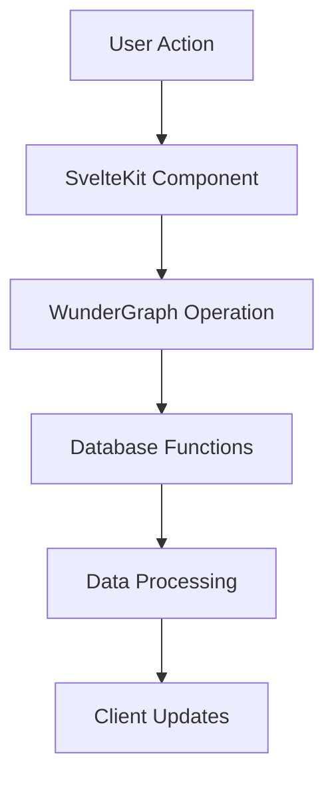
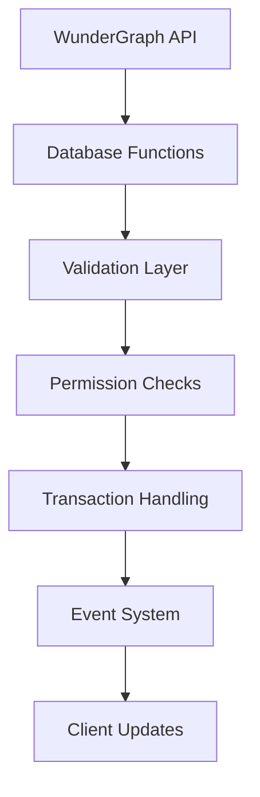
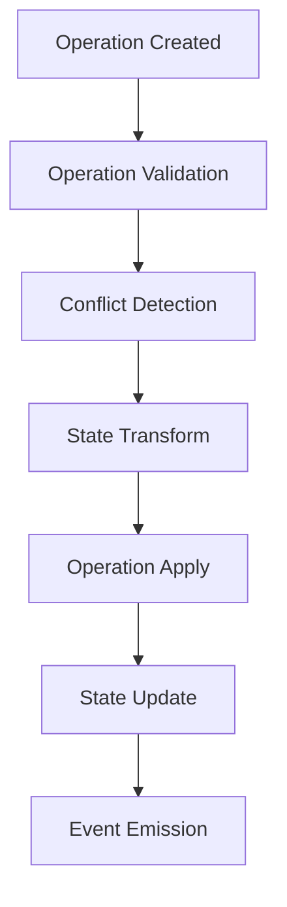
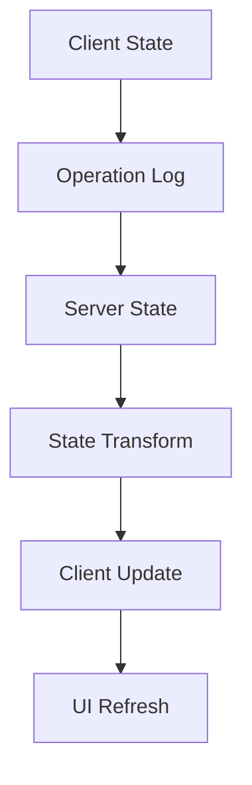
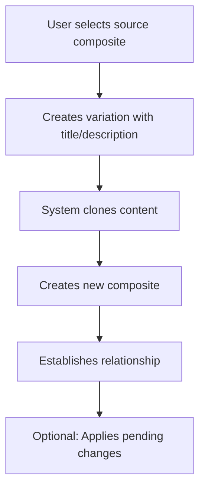
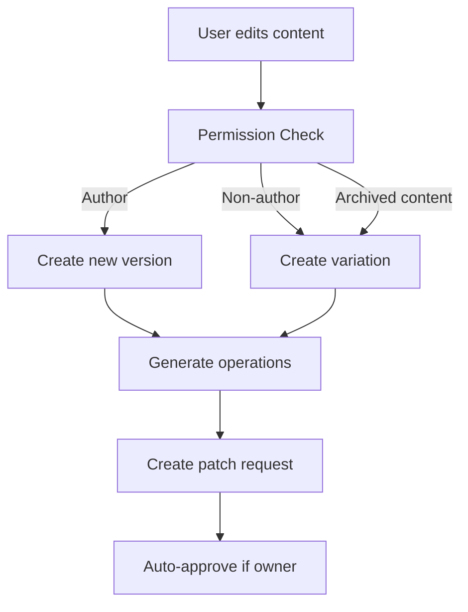
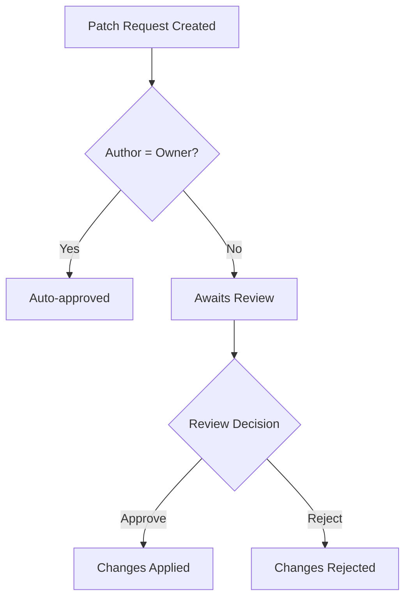

# Visioncreator Version Control & Composite System Documentation

## Overview

The Visioncreator platform implements a sophisticated version control and composite system that allows for collaborative content management with features similar to Git but optimized for content creation. The system is inspired by Yjs's CRDT (Conflict-free Replicated Data Type) approach for handling operations and conflicts, adapted for our specific use case of content versioning and collaboration.

## Core Concepts

### 1. Database Structure (DB)

The system uses a versioned database structure with three main components:

- **db**: Active content versions
  - Stores current versions of content
  - Maintains schema references
  - Tracks authorship and metadata
  - Handles immediate state
  - Provides database functions for content editing and validation

- **db_archive**: Historical content versions
  - Archives previous versions
  - Maintains version history
  - Enables rollback capabilities
  - Preserves audit trail

- **db_operations**: Granular changes tracking (Yjs-inspired)
  - Records atomic operations
  - Supports conflict resolution
  - Enables collaborative editing
  - Maintains operation history

### Snapshot ID System

The system uses a `snapshot_id` field (UUID) to uniquely identify each version of content:

1. **Version Identification**
   - Each content version has a unique `snapshot_id`
   - Generated as a UUID when content is created or updated
   - Used to track the exact state of content at a specific point in time
   - Example:
     ```typescript
     interface ContentVersion {
         id: string;
         snapshot_id: string;
         json: any;
         author: string;
         created_at: string;
         last_modified_at: string;
     }
     ```

2. **Performance Optimization**
   - Enables quick identification of specific content versions
   - Facilitates efficient content retrieval
   - Supports caching strategies
   - Example usage:
     ```typescript
     async function getContentBySnapshot(snapshot_id: string) {
         // First check active content
         let content = await db.findOne({ snapshot_id });
         
         // If not found, check archive
         if (!content) {
             content = await db_archive.findOne({ snapshot_id });
         }
         
         return content;
     }
     ```

3. **Tracking and Auditing**
   - Provides immutable reference to specific content versions
   - Enables precise tracking of content lineage
   - Supports audit requirements
   - Example query:
     ```sql
     SELECT * FROM db_operations 
     WHERE content_snapshot_id = '123e4567-e89b-12d3-a456-426614174000';
     ```

### Important Note on Content Versioning

In our system, content versioning is managed through:
1. The `snapshot_id` field for unique version identification
2. The complete operation log for tracking changes
3. The patch request system for managing updates

This approach provides several benefits:
- Immutable content versions
- Clear lineage tracking
- Support for branching and variations
- Efficient storage of historical versions

### 2. Composites

Composites are the fundamental building blocks that represent content units. Each composite:
- Has a unique ID
- Contains a title and description
- Points to a specific content version (compose_id)
- Can have relationships with other composites
- Supports variations and forks

### 3. Patch Requests

Similar to Pull Requests in Git, Patch Requests manage proposed changes:
- Track changes between content versions
- Support approval/rejection workflows
- Include detailed operations history
- Enable collaborative review processes
- Auto-approve when users edit their own content

## Fullstack Architecture Flow

### 1. Client-Side Operations



1. **User Interface Layer**
   - Components handle user interactions
   - Manages local state with Svelte stores
   - Implements optimistic updates
   - Triggers database operations via WunderGraph

2. **WunderGraph Integration**
   - Handles API communication
   - Manages authentication state
   - Provides type-safe operations
   - Calls database functions directly

### 2. Server-Side Processing



1. **Database Functions**
   - Validate incoming content
   - Check permissions and constraints
   - Apply business logic
   - Manage transaction boundaries
   - Handle variations and cloning

2. **Database Interaction**
   - Executes operations atomically
   - Maintains ACID properties
   - Handles concurrent access
   - Manages version control
   - Creates variations when needed

### 3. Operation Flow (Yjs-Inspired)



#### Operation Types

1. **Add Operation**
```typescript
interface AddOperation {
    type: 'add';
    path: string[];
    value: any;
    metadata: {
        timestamp: number;
        author: string;
        context?: any;
    };
}
```

2. **Remove Operation**
```typescript
interface RemoveOperation {
    type: 'remove';
    path: string[];
    oldValue: any;
    metadata: {
        timestamp: number;
        author: string;
        context?: any;
    };
}
```

3. **Replace Operation**
```typescript
interface ReplaceOperation {
    type: 'replace';
    path: string[];
    oldValue: any;
    newValue: any;
    metadata: {
        timestamp: number;
        author: string;
        context?: any;
    };
}
```

### 4. Conflict Resolution

The system uses a Yjs-inspired approach to handle conflicts:

1. **Operation-Based Resolution**
   - Each operation is atomic and self-contained
   - Operations carry enough context for resolution
   - Conflicts are resolved at operation level
   - Maintains causal history

2. **Conflict Types**
   ```sql
   -- Example conflict detection query
   SELECT detect_operation_conflicts(
       operation_a_id,
       operation_b_id
   ) FROM db_operations;
   ```

3. **Resolution Strategies**
   - Last-write-wins for simple conflicts
   - Structural merge for compatible changes
   - Three-way merge for complex conflicts
   - Manual resolution for unresolvable conflicts

### 5. State Synchronization



1. **State Management**
   - Maintains operation log
   - Tracks snapshot IDs
   - Handles state convergence
   - Ensures eventual consistency

2. **Synchronization Process**
   ```typescript
   interface StateSync {
       snapshot_id: string;
       operations: Operation[];
       timestamp: number;
       metadata: {
           author: string;
           context: any;
       };
   }
   ```

## Implementation Details

### 1. Database Functions

```sql
-- Apply operations to a JSON object
CREATE OR REPLACE FUNCTION apply_operations(
    p_base_json jsonb,
    p_operations uuid[]
) RETURNS jsonb AS $$
    -- Implementation handles operation application
    -- and state transformation
$$;

-- Detect conflicts between operations
CREATE OR REPLACE FUNCTION detect_operation_conflicts(
    p_operations_a uuid[],
    p_operations_b uuid[]
) RETURNS TABLE(
    operation_a uuid,
    operation_b uuid,
    conflict_type text
) AS $$
    -- Implementation handles conflict detection
    -- and classification
$$;

-- Process edit with validation
CREATE OR REPLACE FUNCTION process_edit(
    p_id uuid,
    p_json jsonb,
    p_user_id uuid
) RETURNS jsonb AS $$
    -- Validates content against schema
    -- Checks user permissions
    -- Creates variations for non-authors
    -- Creates clones for archived content
    -- Manages versioning with snapshot_id
    -- Archives old versions
    -- Creates patch requests
$$;
```

### 2. API Layer

The WunderGraph API layer provides:

1. **Operation Endpoints**
   - Simple interface to database functions
   - Authentication and authorization
   - Error handling and reporting
   - Client-side type safety

2. **Query Capabilities**
   - Version history retrieval
   - Operation log access
   - State snapshots
   - Relationship queries

## Security and Performance

1. **Security Measures**
   - Row Level Security (RLS) for all operations
   - Operation validation and sanitization
   - Author-based permissions
   - Rate limiting and quotas

2. **Performance Optimizations**
   - Database functions reduce round trips
   - Efficient indexing
   - Transaction boundaries
   - Lazy loading

## Best Practices

1. **Operation Design**
   - Keep operations atomic
   - Include sufficient context
   - Maintain idempotency
   - Handle edge cases

2. **State Management**
   - Use optimistic updates
   - Implement proper error handling
   - Maintain consistency
   - Handle offline scenarios

3. **Conflict Resolution**
   - Define clear resolution strategies
   - Implement automatic resolution where possible
   - Provide manual resolution UI
   - Maintain operation history

## User Flows

### 1. Creating Content Variations



**Implementation Details:**
- Handled by `create_composite_variation` function in SQL
- Automatic variation creation when non-authors edit content
- Automatic variation creation when editing archived content
- Maintains relationship metadata
- Auto-generates snapshot IDs for tracking

### 2. Making Content Changes



**Implementation Details:**
- Permission checks done in `process_edit` function
- Changes tracked through `db_operations`
- Automatic patch request generation
- Granular operation tracking (add/remove/replace)
- Variations created for both non-author edits and archived content edits

### 3. Review and Approval Process



**Implementation Details:**
- Auto-approval handled by `auto_approve_own_patch_requests` trigger
- Manual approval through `approve_patch_request` function
- Rejection through `reject_patch_request` function
- UI components in `PatchRequests.svelte` for review interface
- WunderGraph operation `updateEditRequest.ts` for API integration

## Technical Components

### 1. Database Operations (`db_operations.sql`)

Tracks granular changes with:
- Operation types (add/remove/replace)
- Path tracking for precise changes
- Metadata storage
- Conflict detection

### 2. Composite Management (`db_composite.sql`)

Handles:
- Composite creation and relationships
- Content version management
- Author tracking
- Relationship metadata

### 3. Patch Request System (`db_patch_requests.sql`)

Manages:
- Change proposals
- Approval workflows
- Version transitions
- Operation aggregation

### 4. Query and Mutation APIs

#### ComposeProposal
- Manages content composition
- Handles variation creation
- Supports relationship management

#### PatchRequests
- Lists and manages change requests
- Provides detailed change information
- Supports approval workflows

#### QueryComposeProposal
- Retrieves composite details
- Resolves relationships
- Handles content versioning

#### EditDB
- Simple wrapper around database functions
- Passes user authentication to database
- Handles errors and responses

## Error Handling

The system includes robust error handling for:
- Content conflicts
- Relationship cycles
- Invalid operations
- Missing permissions
- Version conflicts

## Security Considerations

- Row Level Security (RLS) enabled on all tables
- Author-based permissions
- Service role restrictions
- Authenticated operation requirements 