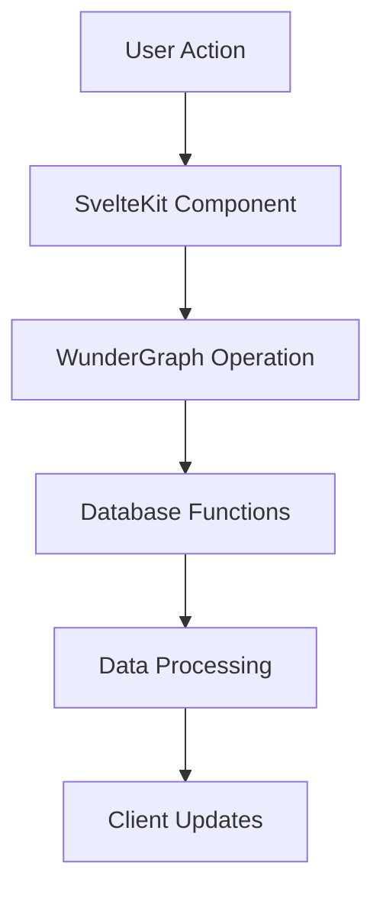
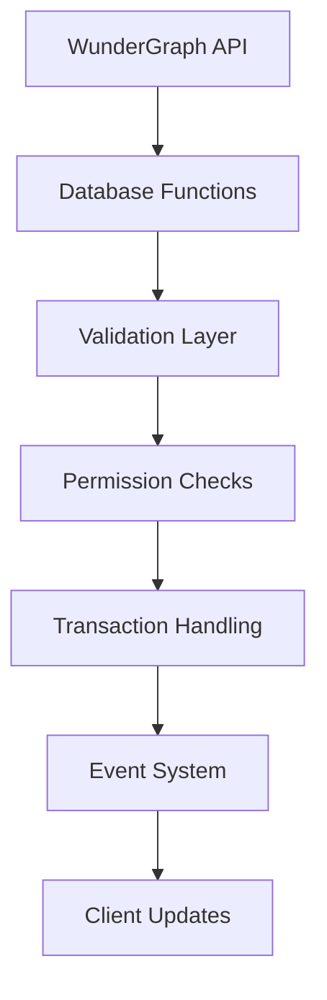
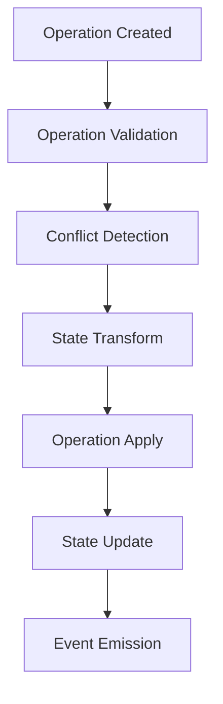
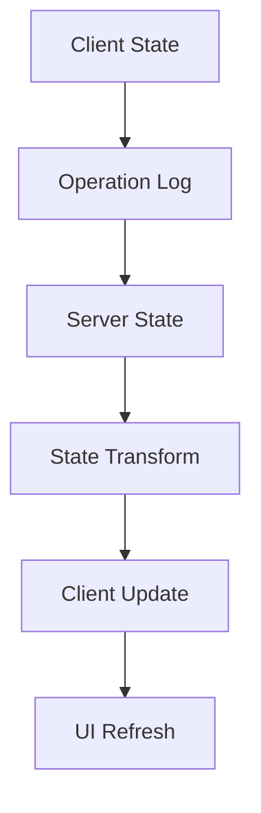
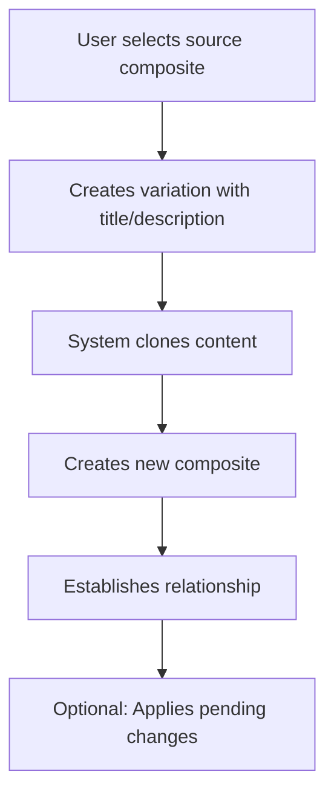
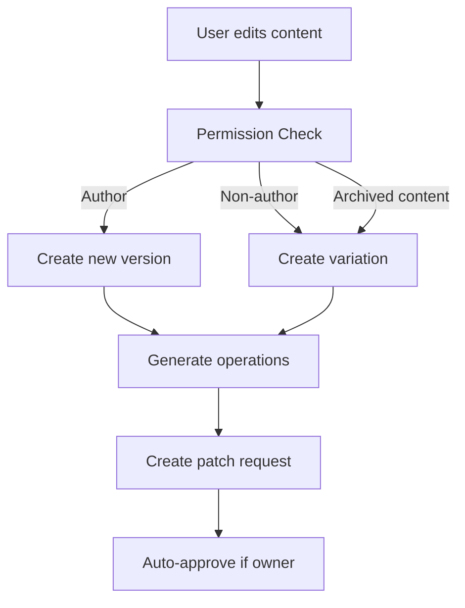
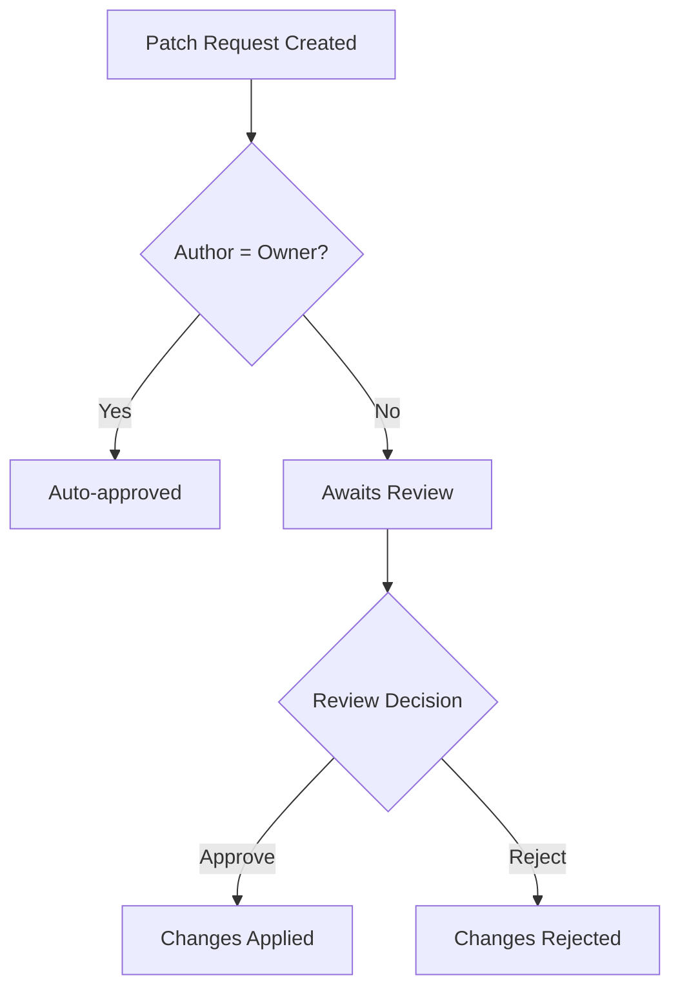

# Visioncreator Version Control & Composite System Documentation

## Overview

The Visioncreator platform implements a sophisticated version control and composite system that allows for collaborative content management with features similar to Git but optimized for content creation. The system is inspired by Yjs's CRDT (Conflict-free Replicated Data Type) approach for handling operations and conflicts, adapted for our specific use case of content versioning and collaboration.

## Core Concepts

### 1. Database Structure (DB)

The system uses a versioned database structure with three main components:

- **db**: Active content versions
  - Stores current versions of content
  - Maintains schema references
  - Tracks authorship and metadata
  - Handles immediate state
  - Provides database functions for content editing and validation

- **db_archive**: Historical content versions
  - Archives previous versions
  - Maintains version history
  - Enables rollback capabilities
  - Preserves audit trail

- **db_operations**: Granular changes tracking (Yjs-inspired)
  - Records atomic operations
  - Supports conflict resolution
  - Enables collaborative editing
  - Maintains operation history

### Version Property Explained

The version property in our Yjs-inspired operation-based system serves a different purpose than traditional sequential versioning:

1. **Clock Vector Component**
   - Acts as part of the logical clock vector in our CRDT system
   - Represents local sequence number for a particular client/node
   - NOT used for traditional optimistic concurrency control
   - Example:
     ```typescript
     interface ClockVector {
         clientId: string;
         localVersion: number;
         timestamp: number;
     }
     ```

2. **Performance Optimization**
   - Quick way to check if ANY changes occurred
   - Helps with cache invalidation decisions
   - Does NOT determine the exact state
   - Example usage:
     ```typescript
     async function hasAnyChanges(contentId: string, lastKnownVector: ClockVector) {
         const currentVector = await getClockVector(contentId);
         return !vectorsEqual(currentVector, lastKnownVector);
     }
     ```

3. **Monitoring and Debugging**
   - Tracks update frequency per client
   - Helps identify high-activity clients
   - Assists in troubleshooting sync patterns
   - Example monitoring:
     ```sql
     SELECT client_id, MAX(local_version) as version_height
     FROM db_operations 
     GROUP BY client_id 
     ORDER BY version_height DESC;
     ```

4. **Migration and Compatibility**
   - Supports legacy system integrations
   - Helps with transitional architectures
   - NOT used for state resolution
   - Example bridge:
     ```typescript
     interface StateCompatibility {
         yjsState: Array<Operation>;
         legacyVersion: number;  // For backwards compatibility only
     }
     ```

### Important Note on Concurrent Edits

In our Yjs-inspired system, the source of truth for the document state comes from:
1. The complete operation log
2. The CRDT merge rules
3. The vector clock timestamps

The version number is NOT used for:
- State resolution
- Conflict detection
- Determining document equality
- Operation ordering

This is a significant departure from traditional version control systems, where version numbers determine the document state. In our system, concurrent edits are handled through the operation log and CRDT rules, making the version number primarily useful for performance optimization and monitoring.

### 2. Composites

Composites are the fundamental building blocks that represent content units. Each composite:
- Has a unique ID
- Contains a title and description
- Points to a specific content version (compose_id)
- Can have relationships with other composites
- Supports variations and forks

### 3. Patch Requests

Similar to Pull Requests in Git, Patch Requests manage proposed changes:
- Track changes between content versions
- Support approval/rejection workflows
- Include detailed operations history
- Enable collaborative review processes
- Auto-approve when users edit their own content

## Fullstack Architecture Flow

### 1. Client-Side Operations



1. **User Interface Layer**
   - Components handle user interactions
   - Manages local state with Svelte stores
   - Implements optimistic updates
   - Triggers database operations via WunderGraph

2. **WunderGraph Integration**
   - Handles API communication
   - Manages authentication state
   - Provides type-safe operations
   - Calls database functions directly

### 2. Server-Side Processing



1. **Database Functions**
   - Validate incoming content
   - Check permissions and constraints
   - Apply business logic
   - Manage transaction boundaries
   - Handle variations and cloning

2. **Database Interaction**
   - Executes operations atomically
   - Maintains ACID properties
   - Handles concurrent access
   - Manages version control
   - Creates variations when needed

### 3. Operation Flow (Yjs-Inspired)



#### Operation Types

1. **Add Operation**
```typescript
interface AddOperation {
    type: 'add';
    path: string[];
    value: any;
    metadata: {
        timestamp: number;
        author: string;
        context?: any;
    };
}
```

2. **Remove Operation**
```typescript
interface RemoveOperation {
    type: 'remove';
    path: string[];
    oldValue: any;
    metadata: {
        timestamp: number;
        author: string;
        context?: any;
    };
}
```

3. **Replace Operation**
```typescript
interface ReplaceOperation {
    type: 'replace';
    path: string[];
    oldValue: any;
    newValue: any;
    metadata: {
        timestamp: number;
        author: string;
        context?: any;
    };
}
```

### 4. Conflict Resolution

The system uses a Yjs-inspired approach to handle conflicts:

1. **Operation-Based Resolution**
   - Each operation is atomic and self-contained
   - Operations carry enough context for resolution
   - Conflicts are resolved at operation level
   - Maintains causal history

2. **Conflict Types**
   ```sql
   -- Example conflict detection query
   SELECT detect_operation_conflicts(
       operation_a_id,
       operation_b_id
   ) FROM db_operations;
   ```

3. **Resolution Strategies**
   - Last-write-wins for simple conflicts
   - Structural merge for compatible changes
   - Three-way merge for complex conflicts
   - Manual resolution for unresolvable conflicts

### 5. State Synchronization



1. **State Management**
   - Maintains operation log
   - Tracks version vectors
   - Handles state convergence
   - Ensures eventual consistency

2. **Synchronization Process**
   ```typescript
   interface StateSync {
       version: number;
       operations: Operation[];
       timestamp: number;
       metadata: {
           author: string;
           context: any;
       };
   }
   ```

## Implementation Details

### 1. Database Functions

```sql
-- Apply operations to a JSON object
CREATE OR REPLACE FUNCTION apply_operations(
    p_base_json jsonb,
    p_operations uuid[]
) RETURNS jsonb AS $$
    -- Implementation handles operation application
    -- and state transformation
$$;

-- Detect conflicts between operations
CREATE OR REPLACE FUNCTION detect_operation_conflicts(
    p_operations_a uuid[],
    p_operations_b uuid[]
) RETURNS TABLE(
    operation_a uuid,
    operation_b uuid,
    conflict_type text
) AS $$
    -- Implementation handles conflict detection
    -- and classification
$$;

-- Edit content with validation
CREATE OR REPLACE FUNCTION edit_content_with_validation(
    p_id uuid,
    p_json jsonb,
    p_user_id uuid
) RETURNS jsonb AS $$
    -- Validates content against schema
    -- Checks user permissions
    -- Creates variations for non-authors
    -- Creates clones for archived content
    -- Manages versioning
$$;
```

### 2. API Layer

The WunderGraph API layer provides:

1. **Operation Endpoints**
   - Simple interface to database functions
   - Authentication and authorization
   - Error handling and reporting
   - Client-side type safety

2. **Query Capabilities**
   - Version history retrieval
   - Operation log access
   - State snapshots
   - Relationship queries

## Security and Performance

1. **Security Measures**
   - Row Level Security (RLS) for all operations
   - Operation validation and sanitization
   - Author-based permissions
   - Rate limiting and quotas

2. **Performance Optimizations**
   - Database functions reduce round trips
   - Efficient indexing
   - Transaction boundaries
   - Lazy loading

## Best Practices

1. **Operation Design**
   - Keep operations atomic
   - Include sufficient context
   - Maintain idempotency
   - Handle edge cases

2. **State Management**
   - Use optimistic updates
   - Implement proper error handling
   - Maintain consistency
   - Handle offline scenarios

3. **Conflict Resolution**
   - Define clear resolution strategies
   - Implement automatic resolution where possible
   - Provide manual resolution UI
   - Maintain operation history

## User Flows

### 1. Creating Content Variations



**Implementation Details:**
- Handled by database functions in SQL
- Automatic variation creation when non-authors edit content
- Automatic variation creation when editing archived content
- Maintains relationship metadata
- Auto-generates version tracking

### 2. Making Content Changes



**Implementation Details:**
- Permission checks done in database
- Changes tracked through `db_operations`
- Automatic patch request generation
- Granular operation tracking (add/remove/replace)
- Variations created for both non-author edits and archived content edits

### 3. Review and Approval Process



## Technical Components

### 1. Database Operations (`db_operations.sql`)

Tracks granular changes with:
- Operation types (add/remove/replace)
- Path tracking for precise changes
- Metadata storage
- Conflict detection

### 2. Composite Management (`db_composite.sql`)

Handles:
- Composite creation and relationships
- Content version management
- Author tracking
- Relationship metadata

### 3. Patch Request System (`db_patch_requests.sql`)

Manages:
- Change proposals
- Approval workflows
- Version transitions
- Operation aggregation

### 4. Query and Mutation APIs

#### ComposeProposal
- Manages content composition
- Handles variation creation
- Supports relationship management

#### PatchRequests
- Lists and manages change requests
- Provides detailed change information
- Supports approval workflows

#### QueryComposeProposal
- Retrieves composite details
- Resolves relationships
- Handles content versioning

#### EditDB
- Simple wrapper around database functions
- Passes user authentication to database
- Handles errors and responses

## Error Handling

The system includes robust error handling for:
- Content conflicts
- Relationship cycles
- Invalid operations
- Missing permissions
- Version conflicts

## Security Considerations

- Row Level Security (RLS) enabled on all tables
- Author-based permissions
- Service role restrictions
- Authenticated operation requirements 